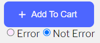
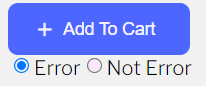

## 요구사항 정의

### 1. Micro Interaction 아이디어를 적극적으로 활용하여 최대한 깔끔하고 효율적인 구현

#### - Micro Interaction이란?

- 제품 이용 시 하나하나의 피드백을 세밀하게 제공하는 것.

#### - Four Components

1. 트리거
   - 트리거는 마이크로 인터랙션을 활성화 하는 작업입니다.
   - 사용자 시작 또는 시스템 시작의 두 그룹으로 분류할 수 있습니다.
   - 사용자 시작 트리거는 가장 흔하며 버튼, 텍스트 링크, 드롭다운 등의 형태로 모든 곳에서 찾을 수 있습니다. 사용자가 다른 페이지로 이동하는 버튼(트리거)를 클릭하는 것이 간단한 예입니다.
   - 시스템 시작 트리거는 자동화 되고 특정 조건이 충족될 때 트리거되기 때문에 약간 더 복잡합니다.
     예를 들어, 인스타그램에 있는 사진이 마음에 들면 사용자에게 알림을 보내도록 트리거하는 알림입니다.
2. 규칙
   - 트리거를 실행 시킨 후에는 다음에 무슨 일이 일어나는지에 대한 후속 주치가 필요합니다.
   - 사용자가 이 버튼을 클릭하면 어떻게 됩니까? 그들은 새로운 페이지로 안내되었나요? 쇼핑 카트에 상품이 추가될까요?
   - 시스템 시작 트리거도 마찬가지 입니다.
     모든 조건이 충족되면 어떻게 됩니까? 사용자가 30분(조건) 동안 비활성 상태인 경우 해당 사용자는 계정(규칙)에서 로그아웃됩니다.
3. 피드백
   - 마이크로 인터렉션의 과정의 크리에이티브한 파트입니다.
   - 사용자들에게 작업이 수행되었거나 변경되었음을 알리는 데 사용됩니다.
   - 로딩화면, hover효과, 애니메이션, gif, 진동 등의 형태가 될 수 있습니다. 마이크로 인터렉션이 설계 될 수 있는 방법에는 많은 예가 있습니다.
4. 루프 그리고 모드
   - 루프는 마이크로 인터랙션의 길이, 반복 여부 또는 시간이 지남에 따라 변경 여부를 결정합니다. 마지막으로 제품을 사용했을 때를 생각해 보세요, 처음 사용했을 때의 경험은 10번과 비교했을때 다른가요? 대부분의 제품은 처음 보는 사용자에게 온보드 프로세스와 비주얼만 보여주므로 시간이 지남에 따라 미세한 상호 작용이 변경됩니다.
   - 모드를 사용하여 피드백을 수신하는 방법을 변경할 수 있습니다. 예를 들어 휴대폰에서 문자 메시지를 수신 할 때 기본 모드와 비교하여 전화기가 자동 모드일 때의 피드백은 무엇입니까?

### 2. React, Redux, styled-component 사용

- [React](https://ko.reactjs.org/)

- [Redux](https://ko.redux.js.org/), [Redux-toolkit](https://redux-toolkit.js.org/introduction/getting-started)

  - Redux Document를 읽던 중에, 저장소 준비와 리듀서 생산과 불변성 유지 로직(immer 내장), 상태 조각을 한번에 작성하는 등 일반적인 작업들을 단순화해주는 `redux-toolkit`를 추천하고 있었다.
  - `redux-toolkit`의 Document를 읽고, 기존에 사용했던 미들웨어인 `redux-saga`를 사용하지 않고, 반복적으로 사용되는 코드들을 상당히 줄일 수 있을 것으로 판단하여 사용한다.

- [styled-component](https://styled-components.com/)
  - `css in js`와 `css`의 차이에 관한 [포스트](https://dev.to/adancarrasco/the-one-about-css-vs-css-in-js-2gn0)와 성능에 관련한 [포스트](https://blueshw.github.io/2020/09/27/css-in-js-vs-css-modules/)를 통해서 css를 어떻게 처리할 것인가에 대해 다시 한번 생각해보는 포스트였다.

### 3. Font - [Libre Franklin](https://fonts.google.com/specimen/Libre+Franklin?query=Libre+Franklin) 사용

<hr />

## Micro Interaction

### Header

- Header 영역 고정.
- 노란색 바로 사용자가 어느 위치에 있는 지 진행 상황 출력.

### Market

- `Add To Cart` 버튼 애니메이션.
  - Event
    1. 버튼을 클릭하면, 이벤트에 등록된 비동기 함수가 실행된다.
    2. pending 상태로 진입하며, `loading 변수`가 `true`로 변화한다.
    3. 비동기 함수에 받아온, 에러를 발생시키는 변수와 서버에서 받아오는 것처럼 동작할 수 있도록 얼마나 시간을 지연시킬 지 정하는 시간 변수를 이용한다.
    4. 완료되면 정상적으로 진행되면 fulfilled 상태로 진입하며 `success 변수`를 `true`를 만들거나, 에러가 발생하면 rejected 상태로 진입하며 `error 변수`를 `true`를 만든다.
  - Success Animation
    1. 버튼을 누르면 글자가 올라간다.
    2. 왼쪽에서 중간까지 카트 이미지가 움직인다.
    3. 중간에서 카트의 색깔이 채워진다.
    4. 카트의 색깔이 다 채워지면 V 모양으로 출력된다.
    5. 중간에서 오른쪽으로 카트가 움직이는데, 끝으로 가면서 45도로 기울이며 간다.
    6. 버튼에 글자가 다시 내려온다.
       <br />
       
  - Error Animation
    - Error 발생 시 빨간 배경으로 바뀌면서 버튼을 흔든다.
      <br />
      

### Review

- 사진이 벗어나는 범위만큼 양방향으로 움직이는 사진 리스트 애니메이션.

### Brands

- 해당 요소가 20% 이상이 보이면 왼쪽 부분은 왼쪽에서 오른쪽 부분으로 움직이고, 오른쪽 부분은 오른쪽에서 왼쪽으로 움직이는 페이지 애니메이션 출력.

### Partners

- Image를 Lazy Loading 적용

  #### Definition

  - 당장 필요하지 않는 이미지들의 로딩 시점을 뒤로 미루는 것이다.
  - yall.js와 같은 라이브러리를 사용해서 구현하면, Intersection Observer 방식이며, 이벤트 기반으로 lazy loading을 되돌리는 방식이고 브라우저 IE11도 지원된다.

  1. 성능 향상
     - lazy loading을 이용하면, 페이지 초기 로딩 시 필요로 한 이미지의 수를 줄일 수 있습니다. 리소스 요청을 줄이는 것은 다운로드 bytes를 줄이는 것이며, 이는 유저가 사용할 수 있는 제한된 네트워크 대역폭의 경쟁을 줄이는 것을 의미합니다. 이것은 디바이스가 다른 리소스들을 더 빠르게 처리해서 다운로드하도록 확보하는 것입니다.
  2. 비용 감소
     - 두 번째 장점은 통신 비용 관점에 있습니다. 이미지 전달 또는 다른 전달할 무언가는 주로 전송 바이트 수에 기반하여 청구됩니다.
     - lazy loading에 대해 앞서 언급했듯이, 이미지가 보여지지 않으명 절대 로딩하지 않으므로, 페이지 내에서 전달할 총 바이트 용량을 줄일 수 있습니다. 특히나 페이지를 이탈하거나 페이지의 제일 상단에만 서비스를 이용하는 유저에게 효과적입니다. 이처럼 네트워크로부터 전송될 바이트의 감소는 전송 비용을 줄입니다.

  #### Step

  1. 최초 렌더링 할 때, image를 제외한 데이터를 가져온다.
  2. Intersection API를 이용하여 Viewport에 보이는 순간 해당 이미지를 서버에서 가져와(현재는 `setTimeout()`을 이용하여 시간을 딜레이시킨 후에 데이터에 변화를 준다) 리렌더링한다.
  3. 3초 동안 사진이 점점 드러난다.

  #### Example

  1. lazy loading으로 콘텐트 요소들이 이동하는 것을 방지하기 위해 콘텐트를 감싸고 있는 컨테이너에 너비/높이를 지정하였다.
  2. 모든 이미지에 lazy load를 적용하지 않는다.

  #### Reference

  [웹 성능 최적화를 위한 Image Lazy Loading 기법](https://helloinyong.tistory.com/297#title-0)

### Team

- 사진이 벗어나는 범위만큼 양방향으로 움직이는 사진 리스트 애니메이션.

### Blog

- 해당 요소가 20% 이상이 보이면 첫 번째는 위에서 아래로, 두 번째는 오른쪽에서 왼쪽으로, 세 번째는 왼쪽에서 오른쪽으로, 네 번째는 아래에서 위로 움직이는 페이지 애니메이션 출력.

### ECommerce

- Market과 같이 Cart Button 애니메이션.

<hr />

## Issue

### - 웹 페이지가 리 렌더링할 때마다 깜빡임 발생.

- 리렌더링 할 때마다 폰트가 Reload되는 경우이다.
- 별도의 css 파일을 만들어서 `@font-face`를 이용한다.

```css
/* font.css */
@font-face {
  font-family: "Libre Franklin";
  font-display: fallback;
  font-weight: 300;
  font-style: normal;
  src: url("LibreFranklin-VariableFont_wght.ttf") format("truetype");
}
```

```javascript
// GlobalFont.js
import { createGlobalStyle } from "styled-components";
import "./fonts/font.css";

const GlobalFont = createGlobalStyle`
  body {
    font-family: 'Libre Franklin', sans-serif;
  }
`;

export default GlobalFont;
```

#### Reference

- [Styled-Components-import-font](https://velog.io/@mokyoungg/Styled-Components-import-font)
- [font-face-import](https://font-face-import.netlify.app/)

<hr />

### - 컴포넌트가 200개 이상 생성되는 경우에 경고 발생

- `Over 200 classes were generated for component styled.div. Consider using the attrs method, together with a style object for frequently changed styles`
- 컴포넌트가 200개 넘게 클래스가 생성될 경우, 해당 Warning이 발생한다. 자주 변경되는 스타일을 style object와 함께 attrs 방법을 이용한다.
- 내 경우에는 Scroll Event를 통해 사용자가 보고있는 페이지가 전체 페이지의 진행 상황을 알려주는 Bar를 표시해주고 있었는데, 여기서 200번 넘게 클래스가 생성된 것이다.

- 기존 코드

```javascript
const CurrentPercent = styled.div`
  position: absolute;
  bottom: 0;
  width: 100%;
  height: 4px;
  background: ${Theme.color.yellow};
  transition: transform 0.3s ease-out;
  transform: ${(props) => `translateX(-${props.scrollBarPercent}%)`};
`;
```

- 변경 코드

```javascript
const CurrentPercent = styled.div.attrs(({ scrollBarPercent }) => ({
  style: {
    transform: `translateX(-${scrollBarPercent}%)`,
  },
}))`
  position: absolute;
  bottom: 0;
  width: 100%;
  height: 4px;
  background: ${Theme.color.yellow};
  transition: transform 0.3s ease-out;
`;
```

#### Reference

[stackoverflow](https://stackoverflow.com/questions/57996925/styled-component-warning-suggesting-i-use-attrs-method-even-though-i-am)

<hr />

### - Warning: Received `false` for a non-boolean attribute. How do I pass a boolean for a custom boolean attribute?

- Warning: Received `false` for a non-boolean attribute `loading`.
  If you want to write it to the DOM, pass a string instead: loading="false" or loading={value.toString()}.
  If you used to conditionally omit it with loading={condition && value}, pass loading={condition ? value : undefined} instead.

- 관련 경고에 대한 설명을 상세하게 작성한 [포스트](https://stackoverflow.com/questions/49784294/warning-received-false-for-a-non-boolean-attribute-how-do-i-pass-a-boolean-f)을 기반으로 요약하여 기술한다.

```html
<!-- src/components/common/Button/CartButton.js -->
<ProductButton onClick={() => onClick()} loading={loading}>
  ...
</ProductButton>
```

- 단순하게 경고를 없애기 위해서는 다음과 같이 표준 속성에 boolean 값이 아니라 string 값이 들어가면 된다. DOM elements들은 속성에 string 값만 들어갈 수 있다.

```html
<ProductButton onClick={() => onClick()} loading={loading.toString()}>
  ...
</ProductButton>
```

- `styled-component`는 태그의 <i>표준 속성 값</i>들을 해시 처리하고, 비표준 속성 값들을 필터링한다. 또한 표준 속성 값들이 string 값이 아니라면 경고를 출력하고, 필터링한다.
  - HTML Tag의 속성에는 `src`, `width`, `height` 등을 가지고 있는데, 이러한 속성들을 <b>HTML 표준 속성</b>이라고 부를 수 있다.
- 최근 5.1 버전에서는 새로운 기능이 추가되었다.
  다음과 같이 prefix 로 `$` 를 사용하게 되면, props 가 실제 DOM 요소에 전달되는 것을 막는다.

```html
<ProductButton onClick={() => onClick()} $loading={loading}>
  ...
</ProductButton>
```

<hr />

## Project Structure

- 문서의 구조는 header, main, footer로 구성되어있다.

```javascript
 src
  │  App.js
  │  index.js
  │
  ├─components // UI를 담당하는 Components
  │  ├─common // 공통적으로 사용하는 컴포넌트
  │  │  ├─Button
  │  │  │      Button.js
  │  │  │      CartButton.js
  │  │  │
  │  │  └─Text
  │  │         Text.js
  │  │
  │  ├─Footer
  │  │      Footer.js
  │  │      index.js
  │  │
  │  ├─Header
  │  │      Header.js
  │  │      index.js
  │  │
  │  └─main
  │      │  Main.js
  │      │
  │      ├─Blog
  │      │      Blog.js
  │      │      index.js
  │      │
  │      ├─Brands
  │      │      Brands.js
  │      │      index.js
  │      │
  │      ├─ECommerce
  │      │      ECommerce.js
  │      │      index.js
  │      │
  │      ├─Market
  │      │      index.js
  │      │      Market.js
  │      │
  │      ├─Partners
  │      │      index.js
  │      │      Partners.js
  │      │
  │      ├─Portfolio
  │      │      index.js
  │      │      Portfolio.js
  │      │
  │      ├─Review
  │      │      index.js
  │      │      Review.js
  │      │
  │      └─Team
  │             index.js
  │             Team.js
  │
  ├─containers // State를 관리하는 Containers
  │  ├─header
  │  │        HeaderContainer.js
  │  │
  │  └─main
  │           BlogContainer.js
  │           BrandsContainer.js
  │           ECommerceContainer.js
  │           MarketContainer.js
  │           ReviewContainer.js
  │
  ├─features // Redux Logic Directory (Redux-toolkit)
  │  ├─market
  │  │       index.js
  │  │
  │  └─review
  │  │       DummyData.js
  │  │       index.js
  │  └─partners
  │          DummyData.js
  │          index.js
  │
  ├─image // image 파일과 같이 정적인 파일들을 담아놓은 Directory.
  │      index.js
  │
  ├─store // Redux Store Directory
  │      index.js
  │
  ├─styles // Global Style을 정의한 Directory.
  │  │  GlobalFont.js
  │  │  GlobalStyles.js
  │  │  Theme.js // 공통의 스타일을 위한 Theme 파일.
  │  │  Keyframes.js // keyframe 파일.
  │  │
  │  └─fonts
  │      │  font.css
  │      │  LibreFranklin-Italic-VariableFont_wght.ttf
  │      │  LibreFranklin-VariableFont_wght.ttf
  │
  └─utils // 이벤트의 효율적인 관리를 위한 Directory.
          debounce.js
          throttle.js
```

### Reference

[MDN](https://developer.mozilla.org/ko/docs/Learn/HTML/Introduction_to_HTML/Document_and_website_structure)

<hr />

## Reference

https://le-penseur.tistory.com/16
